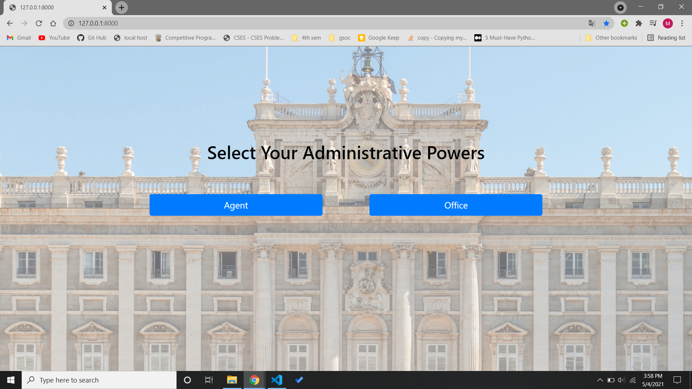
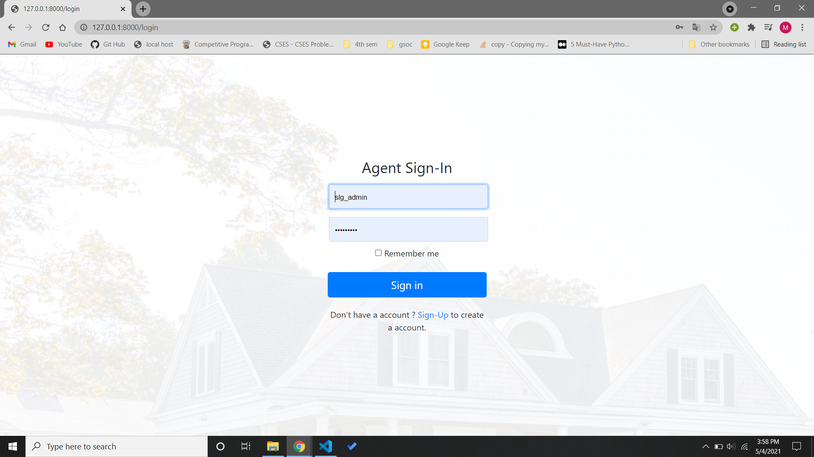
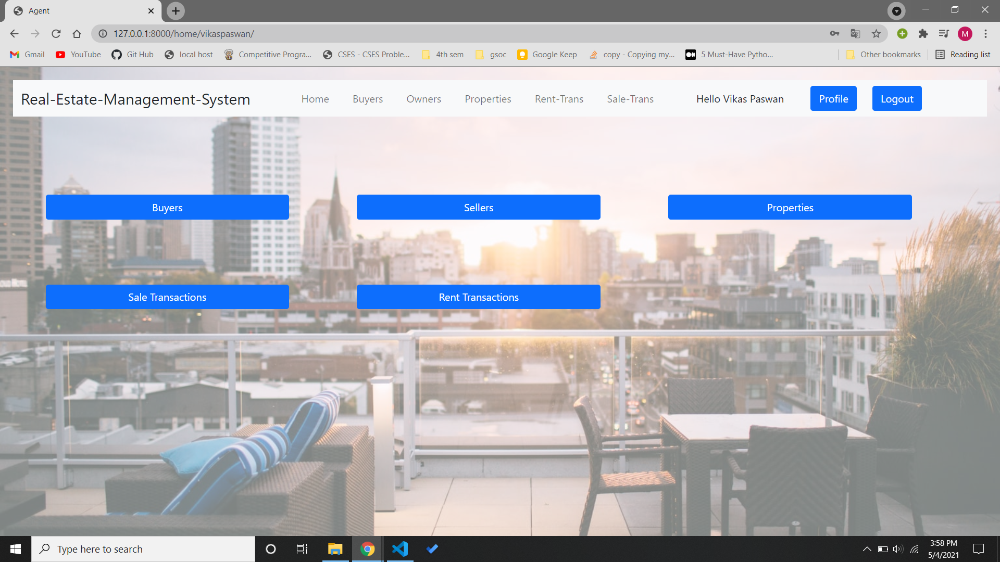
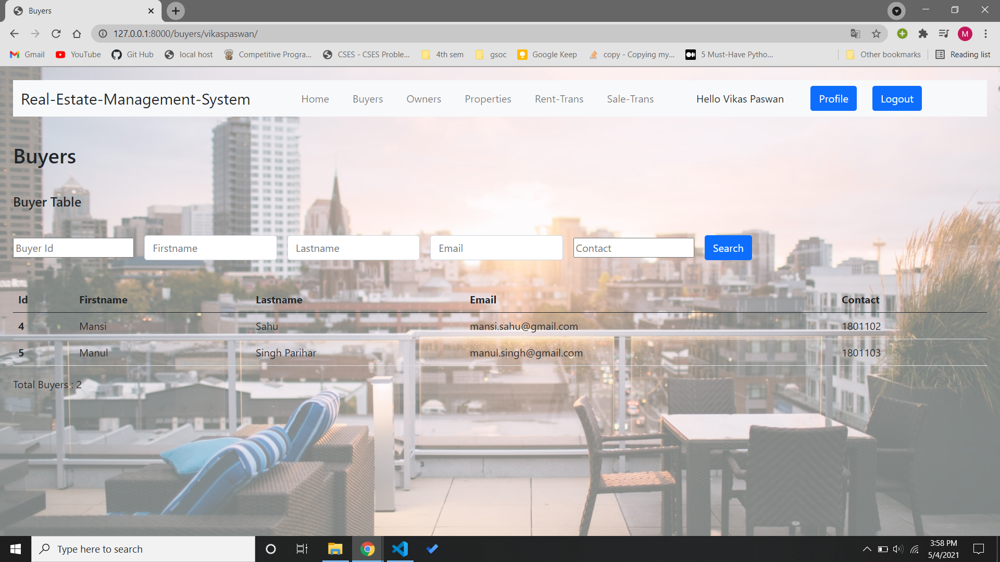
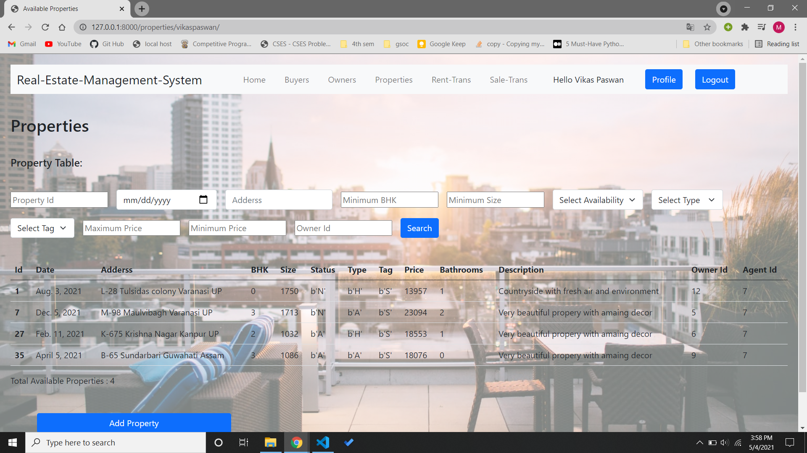
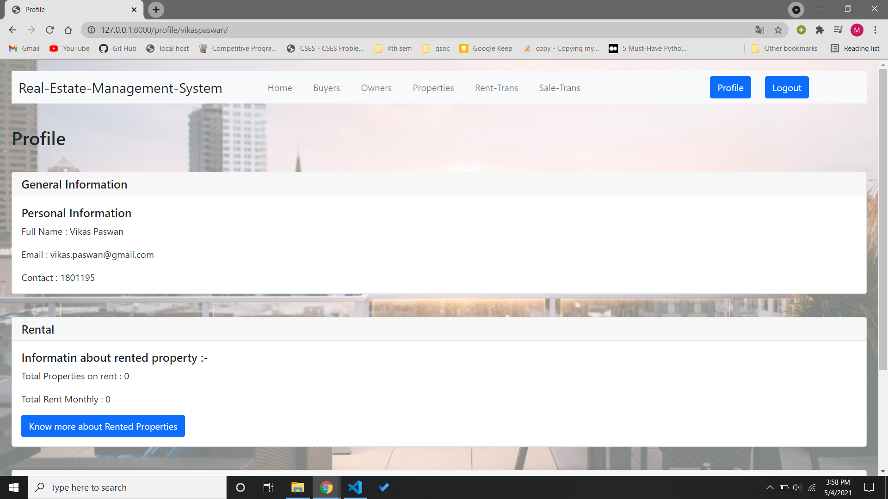
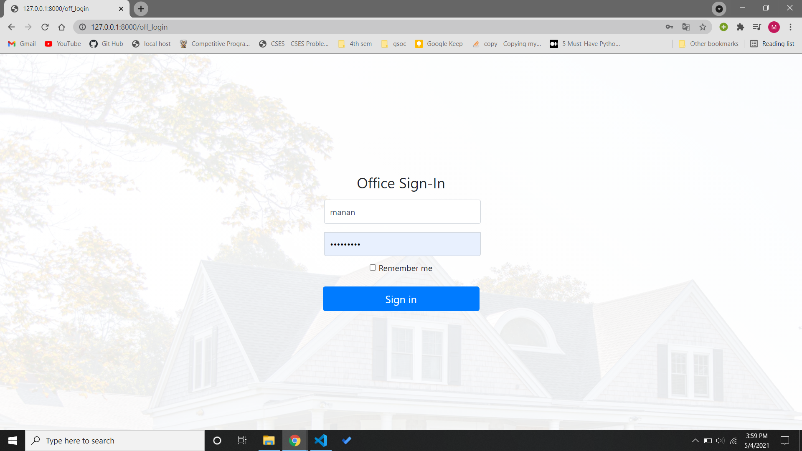
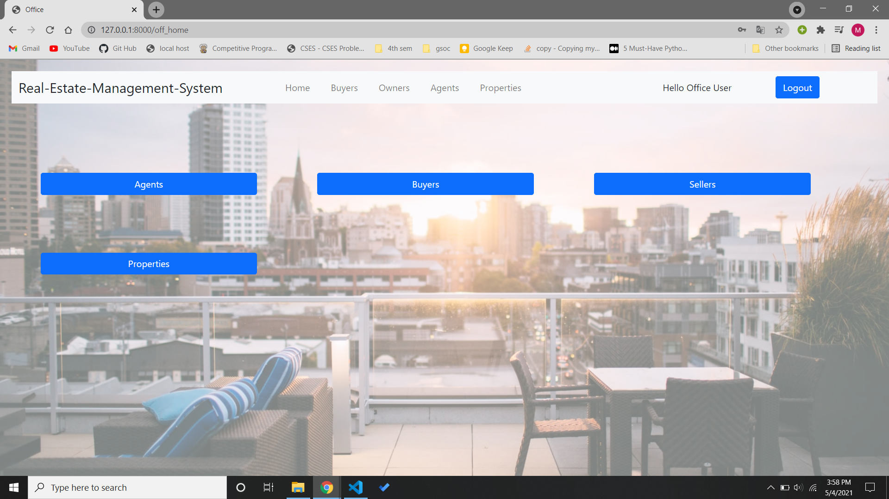
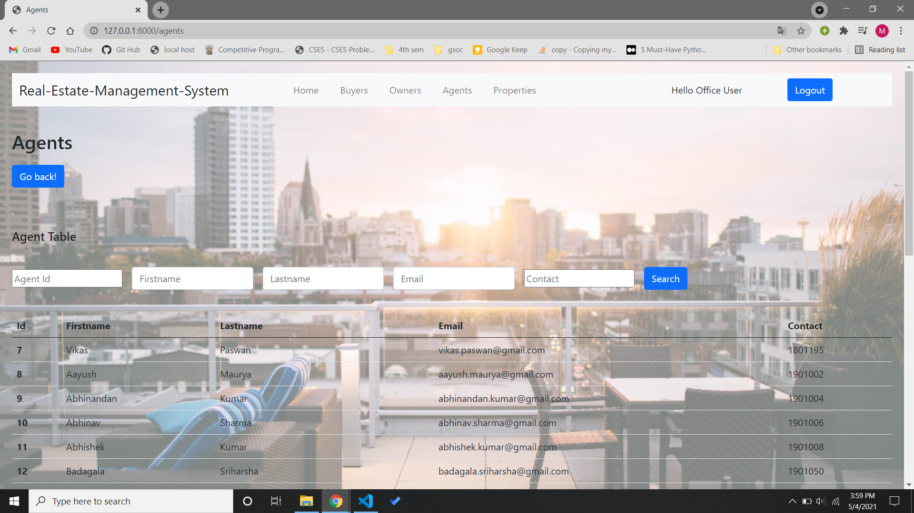

# Real Estate Management System

This is a django webapp for Real-Estate Management System
The backend is made on django , MySQL is used to manage the database. And to make the webpages look good and well orgained Bootstrap is used.

In the project there are two types of user's a Office user and a Agent.

## Agent Interface
Upon singing in as a agent, the agent can add a property , sell a property or rent a property. The agent can also see the profile, and the Buyers, properties and sellers linked to the the agent. Every page has a option to filter things as required by the agent.

**The Agent Interface looks like :**

- Agent Sign-In :-

- Agent Home :-

- Agent Buyers :-

- Agent Properties :-

- Agent Profile :-

## Office Interface
Upon Signing in as a Officer , the office user can see all the agents, properties , Rented and Sold Properties. Every page here also has a filering option to help the office user search about any particular aspect.

**The Office Interface Looks like:**

- Office Sign-In :-

- Office Home :-

- Office Buyers :-

`mysql_project.sql` contains the dumped file of the database used in the project. 